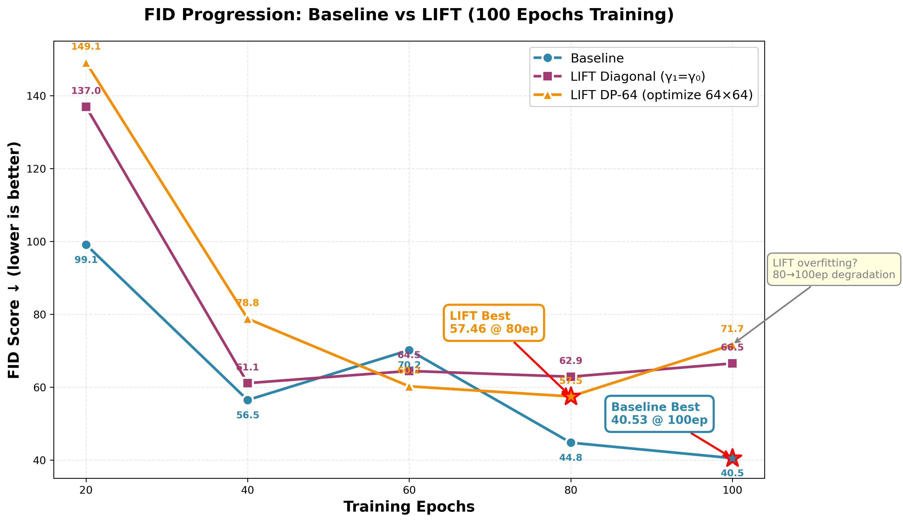
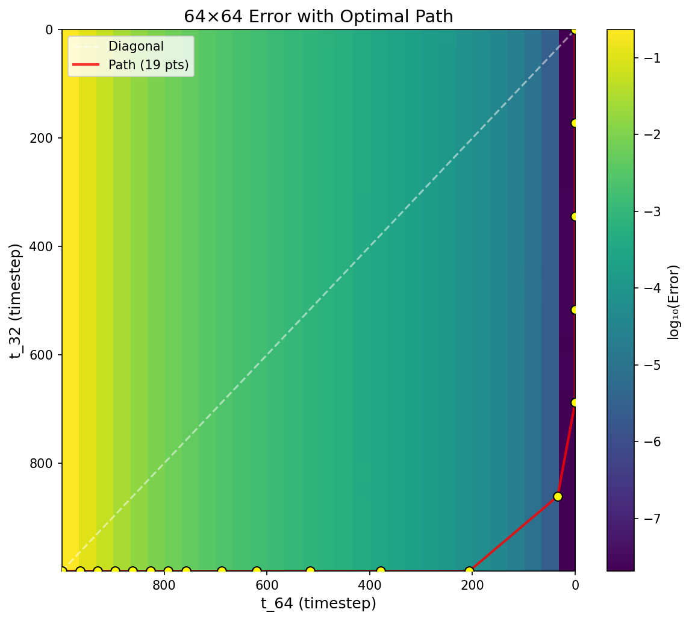
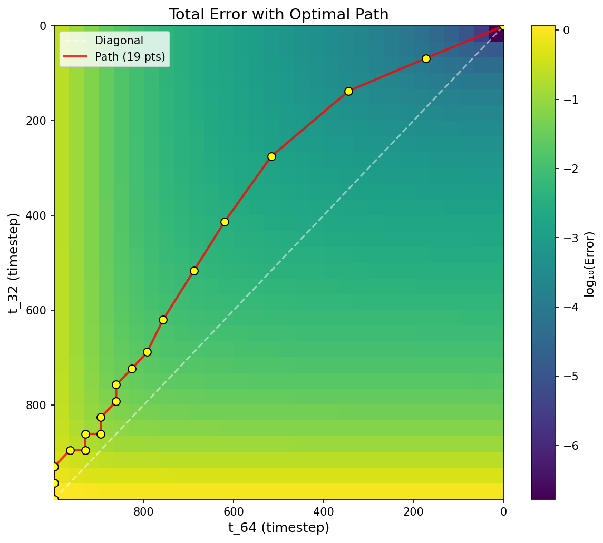

# LIFT Dual-Scale Diffusion Model

A dual-scale diffusion model that jointly denoises 64×64 and 32×32 images with independent timesteps for each scale.

## Results

### Performance Comparison (18 DDIM steps, 15803 images, ~58M parameters)

| Epoch | Baseline | LIFT Diagonal | LIFT DP-64 | LIFT DP-Total |
|------:|---------:|--------------:|-----------:|--------------:|
| 200   | 46.74    | 92.15         | 86.12      | 80.53         |
| 400   | 50.27    | 62.69         | 51.68      | 38.97         |
| 600   | 44.32    | 60.47         | 49.97      | 46.48         |
| 800   | **40.43**| 48.94         | 48.33      | 40.50         |
| 1000  | 40.85    | 81.33         | 76.33      | 63.31         |
| 1200  | 51.91    | 72.41         | 60.81      | 39.79         |
| 1400  | 45.63    | 76.37         | 63.25      | 40.36         |
| 1600  | 47.70    | 64.54         | 60.95      | 39.78         |
| 1800  | 45.36    | 102.01        | 83.14      | 53.66         |
| 2000  | 59.15    | 69.62         | 51.73      | **36.46**     |

### Summary

| Method | Best FID | Best Epoch |
|--------|----------|------------|
| **LIFT DP-Total** | **36.46** | 2000 |
| Baseline | 40.43 | 800 |
| LIFT DP-64 | 48.33 | 800 |
| LIFT Diagonal | 48.94 | 800 |

**Key findings:**
- **LIFT DP-Total @ 2000ep achieves best FID of 36.46**, outperforming Baseline best (40.43) by **9.8%**
- DP-Total consistently outperforms DP-64 and Diagonal across most epochs
- Baseline peaks at 800-1000ep then overfits; LIFT DP-Total continues improving to 2000ep
- LIFT Diagonal is unstable, demonstrating the importance of 2D path optimization



### Optimal Path Visualization (2000 epochs)

The heatmaps show discretization error across the 2D timestep space (t_64 × t_32). The optimal 18-step path (yellow points connected by red line) is computed via dynamic programming to minimize total error.

| 64×64 Error Heatmap | Total Error Heatmap |
|:-------------------:|:-------------------:|
|  |  |

- **Cyan line**: Diagonal path (t_64 = t_32)
- **Yellow points + Red line**: Optimal 18-step DP path
- **DP-Total path** deviates from diagonal to minimize combined error, leading to better FID

### Path Convergence Across Epochs


- **DP-Total paths converge after 1200ep** (green/blue/purple lines overlap)
- **DP-64 paths converge after 1200ep** with L-shaped trajectory (first denoise 64×64, then 32×32)
- Early epochs (400, 800) show different paths due to undertrained model

## Core Findings

1. **2D Path Optimization is Critical**: LIFT with diagonal sampling performs poorly; optimal path scheduling via DP is essential
2. **DP-Total > DP-64**: Optimizing total error (64×64 + 32×32) yields better results than optimizing 64×64 error alone
3. **LIFT scales better with training**: Baseline overfits after 800ep, while LIFT DP-Total continues improving to 2000ep
4. **9.8% FID improvement**: LIFT DP-Total (36.46) vs Baseline (40.43)

## Technical Details

### Discretization Error (vHv) Computation

The discretization error measures how much the model's output changes when the input is perturbed:

$$\text{Error} = v^T \left( J \odot J \right) v$$

We use the **Hutchinson trace estimator** to avoid computing the full Jacobian:

$$v^T (J \odot J) v = \mathbb{E}_{\epsilon} \left[ (J \epsilon)^2 \right]$$

### Chain-Rule Factor

The model operates in $x_t$ space (DDIM), but we want error in SNR ($\gamma$) space.

In DDIM:
$$x_t = \sqrt{\bar{\alpha}} \cdot x_0 + \sqrt{1 - \bar{\alpha}} \cdot \epsilon$$

In SNR parameterization:
$$z = \sqrt{\text{SNR}} \cdot x_0 + \epsilon$$

The relationship:
$$x_t = \frac{z}{\sqrt{\text{SNR} \cdot (1 + \text{SNR})}}$$

So the Jacobian transforms as:
$$\frac{\partial x_t}{\partial z} = \frac{1}{\sqrt{\text{SNR} \cdot (1 + \text{SNR})}}$$

For the squared Jacobian (vHv):
$$(J_z)^2 = \frac{(J_{x_t})^2}{\text{SNR} \cdot (1 + \text{SNR})}$$

```python
def chain_rule_factor(snr):
    """Convert Jacobian from x_t space to z (SNR) space."""
    return 1.0 / (snr * (1.0 + snr))
```

### DP Path to Generation Steps

1. **DP Path**: Maps γ₀ → optimal γ₁
2. **Generation Schedule**: Interpolate to N steps via `logspace(0.01, 100, num_steps)`
3. **Convert to Timesteps**: `snr_to_timestep(gamma)`

### 2D Optimal Path Algorithm

The key insight is treating timestep scheduling as a **2D path optimization problem**. Given a 30×30 error heatmap, we find the optimal N-step path from (0,0) to (29,29) using dynamic programming.

**Cost Function**: Trapezoidal integral of error along path segment
```python
step_cost = (error[i,j] + error[ni,nj]) / 2 * step_size
```
where `step_size = (ni - i) + (nj - j)` is the Manhattan distance.

**Constraints**:
- Path must be monotonically increasing (can only move right/down)
- Maximum jump per step: `max_jump = 5` grid cells in each dimension
- This prevents unrealistic large jumps (e.g., t=999 → t=0 in one step)

**Why trapezoidal integral?**
- Simple `error[ni,nj]` allows jumping to low-error regions (t≈0) immediately
- `error * step_size` still favors large jumps because error at t≈0 is tiny
- Trapezoidal integral `(error_start + error_end) / 2 * step_size` properly accounts for error accumulated along the entire segment

```python
def find_optimal_path_n_steps(error_matrix, num_steps, max_jump=5):
    """Find optimal N-step path using DP with trapezoidal cost."""
    N = error_matrix.shape[0]
    INF = float('inf')

    # dp[step][i][j] = min cost to reach (i,j) in exactly `step` steps
    dp = [[[INF] * N for _ in range(N)] for _ in range(num_steps)]
    parent = [[[None] * N for _ in range(N)] for _ in range(num_steps)]

    dp[0][0][0] = 0

    for step in range(num_steps - 1):
        for i in range(N):
            for j in range(N):
                if dp[step][i][j] == INF:
                    continue
                # Try all valid next positions
                for ni in range(i, min(i + max_jump + 1, N)):
                    for nj in range(j, min(j + max_jump + 1, N)):
                        if ni == i and nj == j:
                            continue
                        # Trapezoidal cost
                        step_size = (ni - i) + (nj - j)
                        cost = (error[i,j] + error[ni,nj]) / 2 * step_size
                        if dp[step][i][j] + cost < dp[step+1][ni][nj]:
                            dp[step+1][ni][nj] = dp[step][i][j] + cost
                            parent[step+1][ni][nj] = (i, j)

    # Backtrack from (N-1, N-1)
    path = [(N-1, N-1)]
    for step in range(num_steps-1, 0, -1):
        path.append(parent[step][path[-1][0]][path[-1][1]])
    return path[::-1]
```

## Model Architecture

```
Input Processing:
  x_64 [B, 3, 64, 64] ─────────────────┐
                                        ├─ concat ─→ [B, 6, 64, 64]
  x_32 [B, 3, 32, 32] ─→ upsample 2× ──┘

Time Embedding:
  t_64 ─→ SinusoidalEmb ─→ MLP ─┐
                                 ├─ concat ─→ MLP ─→ t_combined
  t_32 ─→ SinusoidalEmb ─→ MLP ─┘

UNet Architecture:
  Encoder: [64, 128, 256, 512] channels
  - ResBlock + ResBlock + Attention (if channels >= 128)
  - Downsample 2×

  Bottleneck: 512 channels
  - ResBlock + Attention + ResBlock

  Decoder: [512, 256, 128, 64] channels
  - Upsample 2×
  - Skip connection (concat)
  - ResBlock + ResBlock + Attention (if channels >= 128)

Output Processing:
  [B, 6, 64, 64] ─→ split ─→ noise_pred_64 [B, 3, 64, 64]
                          ─→ downsample 2× ─→ noise_pred_32 [B, 3, 32, 32]
```

## Quick Start

```bash
# Train Baseline
python train_baseline.py --epochs 2000

# Train LIFT
python train_lift.py --epochs 2000

# Evaluate Baseline (all epochs)
./scripts/eval_baseline.sh

# Evaluate LIFT with DP paths
./scripts/eval_lift_dp.sh

# Compute heatmap for a specific epoch
./scripts/compute_heatmap.sh 2000
```

## Dataset

AFHQ (Animal Faces HQ) 64×64, loaded via HuggingFace datasets.
