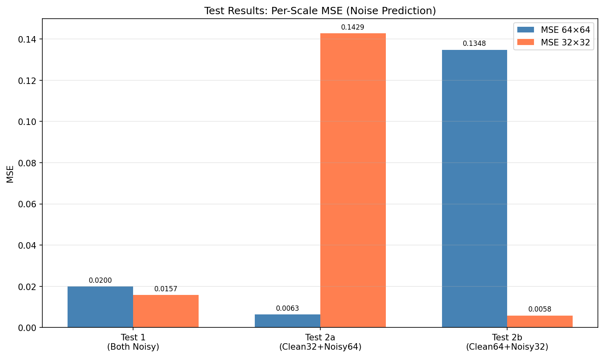
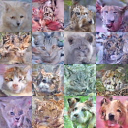
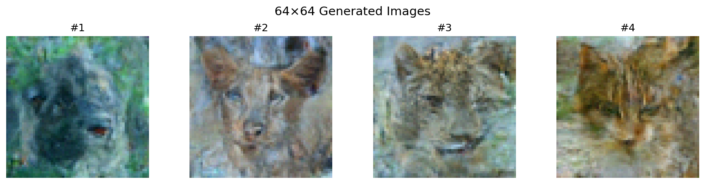
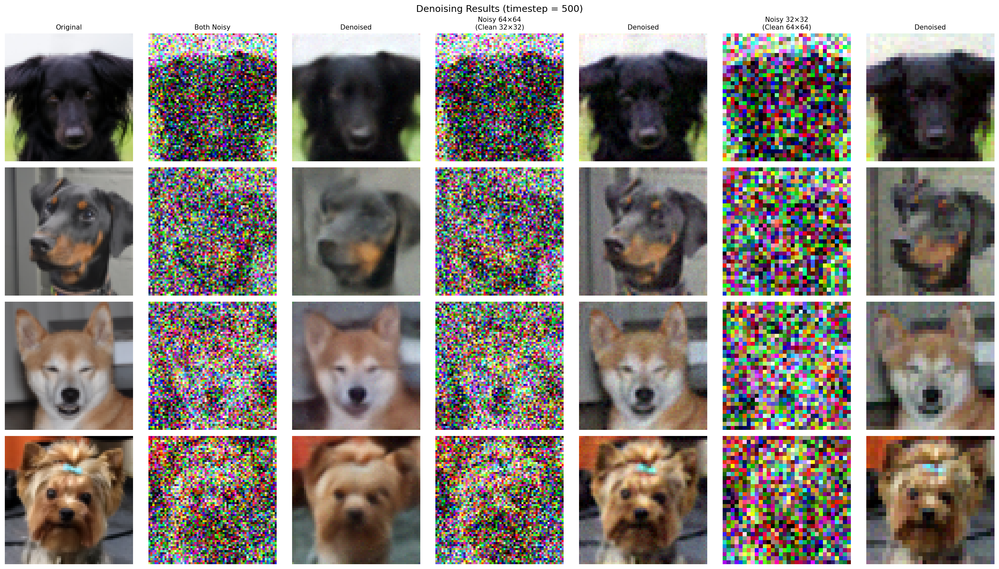
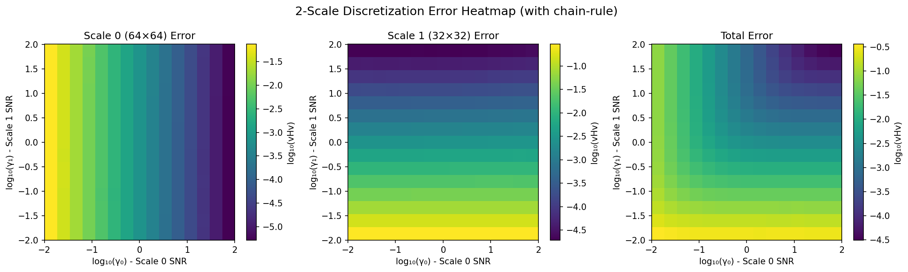

# LIFT Dual-Scale Diffusion Model

A dual-scale diffusion model that jointly denoises 64×64 and 32×32 images with independent timesteps for each scale.

## Key Findings

### 1. Optimal Path Analysis

We computed the discretization error heatmap for different (γ₀, γ₁) combinations, where:
- γ₀: SNR for 64×64 scale
- γ₁: SNR for 32×32 scale

Using Dynamic Programming to find the path that minimizes cumulative total error with monotonic γ₁ constraint:

### Fair Comparison (Same Parameters ~58M, 30 epochs)

| Model / Path Strategy | Description | FID ↓ |
|-----------------------|-------------|-------|
| **Baseline (Non-LIFT)** | Single-scale 64×64 model | **78.83** |
| LIFT DP 64×64 Only | Optimize 64×64 error only | 101.53 |
| LIFT DP Total | Optimize total error (64×64 + 32×32) | 109.20 |
| LIFT Diagonal (γ₁ = γ₀) | Both scales use same SNR | 116.14 |

### Previous Results (Different Parameters)

| Model / Path Strategy | Parameters | FID ↓ |
|-----------------------|------------|-------|
| LIFT DP 64×64 Only | 58.5M | 101.97 |
| Baseline (Non-LIFT) | 14.7M | 105.89 |
| LIFT Diagonal (γ₁ = γ₀) | 58.5M | 107.04 |
| LIFT DP Total | 58.5M | 143.14 |

**Key Findings:**
1. **With equal parameters, Baseline outperforms LIFT** - Baseline (78.83) vs LIFT DP 64×64 (101.53)
2. **LIFT has higher task complexity** - Must learn to denoise two scales simultaneously with independent timesteps
3. **DP 64×64 is the best LIFT path** - Keeps γ₁ low (0.01 → 13.9), meaning 32×32 stays relatively noisy
4. **DP Total path hurts quality** - Jumping γ₁ to max early creates distribution shift from training

### 2. MSE Test Results

| Test | Description | MSE |
|------|-------------|-----|
| Test 1 | Both scales noisy | 0.0178 |
| Test 2a | Clean 32×32 + Noisy 64×64 | 0.0746 |
| Test 2b | Clean 64×64 + Noisy 32×32 | 0.0703 |

## Model Architecture

- **Type**: LIFT Dual Timestep Model
- **Parameters**: 58.5M
- **Hidden dims**: [64, 128, 256, 512]
- **Input**: 64×64 RGB + 32×32 RGB (concatenated after upsampling)
- **Output**: Noise predictions for both scales

## SNR ↔ Timestep Conversion

```
SNR = α_bar / (1 - α_bar)

Low SNR (γ=0.01)  →  High timestep (t=943)  →  High noise
High SNR (γ=100)  →  Low timestep (t=54)    →  Low noise
```

## Discretization Error (vHv) Computation

### What is vHv?

The discretization error measures how much the model's output changes when the input is perturbed. For a denoising model $\hat{x}(z)$, we want to compute:

$$\text{Error} = v^T \left( J \odot J \right) v$$

where:
- $J = \frac{\partial \hat{x}}{\partial z}$ is the Jacobian matrix
- $\odot$ denotes element-wise (Hadamard) product
- $v$ is a weighting vector (uniform in our case)

### Hutchinson Estimator

Computing the full Jacobian is expensive ($O(n^2)$ for $n$ pixels). Instead, we use the **Hutchinson trace estimator**:

$$v^T (J \odot J) v = \mathbb{E}_{\epsilon} \left[ (J \epsilon)^2 \right]$$

where $\epsilon$ is a random Rademacher vector ($\pm 1$ with equal probability).

**Algorithm:**
```python
def get_vHv(f, z, v, K=8):
    """
    Compute vHv using Hutchinson estimator.

    Args:
        f: Model function z -> x_hat
        z: Input (noisy image)
        v: Weighting vector
        K: Number of random samples
    """
    scale = sqrt(v)
    vhv = 0

    for _ in range(K):
        # Random Rademacher vector
        eps = random_choice([-1, +1], size=z.shape)
        u = eps * scale

        # Compute Jacobian-vector product using autodiff
        Ju = jvp(f, z, u)  # ∂f/∂z · u

        # Accumulate squared JVP
        vhv += (Ju ** 2).sum()

    return vhv / K
```

### Chain-Rule Factor

The model operates in $x_t$ space (DDIM parameterization), but we want error in SNR ($\gamma$) space. The conversion requires a chain-rule factor:

$$\gamma(\text{SNR}) = \frac{1}{\text{SNR} \times (1 + \text{SNR})}$$

**Derivation:**

In DDIM, the noisy sample is:
$$x_t = \sqrt{\bar{\alpha}} \cdot x_0 + \sqrt{1 - \bar{\alpha}} \cdot \epsilon$$

In SNR parameterization:
$$z = \sqrt{\text{SNR}} \cdot x_0 + \epsilon$$

The relationship is:
$$x_t = \frac{z}{\sqrt{\text{SNR} \cdot (1 + \text{SNR})}}$$

So the Jacobian transforms as:
$$\frac{\partial x_t}{\partial z} = \frac{1}{\sqrt{\text{SNR} \cdot (1 + \text{SNR})}}$$

For the squared Jacobian (vHv):
$$(J_z)^2 = \frac{(J_{x_t})^2}{\text{SNR} \cdot (1 + \text{SNR})}$$

### Implementation

```python
def chain_rule_factor(snr):
    """Convert Jacobian from x_t space to z (SNR) space."""
    return 1.0 / (snr * (1.0 + snr))

def compute_error(model, z_64, z_32, t_64, t_32, snr_64, snr_32):
    # Define functions for each scale
    def f_64(z): return model(z, z_32, t_64, t_32)[0]
    def f_32(z): return model(z_64, z, t_64, t_32)[1]

    # Compute vHv in x_t space
    vhv_64_xt = get_vHv(f_64, z_64, v=1/(64*64))
    vhv_32_xt = get_vHv(f_32, z_32, v=1/(32*32))

    # Apply chain-rule factor
    error_64 = vhv_64_xt * chain_rule_factor(snr_64)
    error_32 = vhv_32_xt * chain_rule_factor(snr_32)

    return error_64, error_32
```

### Why This Matters

The chain-rule factor ensures that:
1. Error decays as $\text{SNR}^{-2}$ at high SNR (matching theoretical expectations)
2. Error is properly normalized across different noise levels
3. The DP optimal path correctly balances error across the generation trajectory

### DP Path to Generation Steps

1. **DP Path**: Maps γ₀ → optimal γ₁
   ```
   γ₀=0.01  → γ₁=0.01   (start)
   γ₀=0.02  → γ₁=100    (jump to max)
   ...
   γ₀=100   → γ₁=100    (end)
   ```

2. **Generation Schedule**: Interpolate to N steps
   ```python
   gamma0_schedule = logspace(0.01, 100, num_steps)
   gamma1_schedule = interp(gamma0_schedule, dp_path)
   ```

3. **Convert to Timesteps**:
   ```python
   timesteps_64 = [snr_to_timestep(g) for g in gamma0_schedule]
   timesteps_32 = [snr_to_timestep(g) for g in gamma1_schedule]
   ```

## Figures

### Error Heatmap with DP Paths

| DP Total Error | DP 64×64 Error Only (Best) |
|----------------|---------------------------|
|  |  |

**Observation**: The DP 64×64 path keeps γ₁ low (around 0.07), while DP Total path jumps γ₁ to maximum early.

### MSE Test Results


### Generated Samples
| Diagonal Path (FID=107.04) | DP 64×64 Path (FID=101.97) | DP Total Path (FID=143.14) |
|---------------------------|---------------------------|---------------------------|
|  |  |  |

## Usage

### Training
```bash
# Train the dual-timestep model
python train.py --epochs 100 --batch_size 64 --device 0
```

### Generate Images
```bash
# Diagonal path (recommended)
python generate.py --checkpoint checkpoints/lift_full_random_final.pth \
    --num_images 8 --num_steps 50 --output results/generated.png

# DP optimal path
python generate.py --checkpoint checkpoints/lift_full_random_final.pth \
    --dp_path results/error_heatmap_chainrule.pth \
    --num_images 8 --num_steps 50 --output results/generated_dp.png
```

### Compute Error Heatmap
```bash
python compute_error_heatmap.py \
    --checkpoint checkpoints/lift_full_random_final.pth \
    --output results/error_heatmap.png \
    --num_points 15 --device 0
```

### Plot Heatmap with Path
```bash
# Greedy path on scale0 error
python plot_heatmap.py --heatmap results/error_heatmap_chainrule.pth

# DP path on total error
python plot_heatmap.py --heatmap results/error_heatmap_chainrule.pth --dp
```

### FID Evaluation
```bash
# Generate 1000 images with diagonal path
python generate_for_fid.py --checkpoint checkpoints/lift_full_random_final.pth \
    --output_dir results/fid_diagonal --num_images 1000 --mode diagonal

# Generate 1000 images with DP path (total error)
python generate_for_fid.py --checkpoint checkpoints/lift_full_random_final.pth \
    --output_dir results/fid_dp --num_images 1000 --mode dp \
    --heatmap results/error_heatmap_chainrule.pth

# Generate 1000 images with DP path (64×64 error only) - BEST
python generate_for_fid.py --checkpoint checkpoints/lift_full_random_final.pth \
    --output_dir results/fid_dp_64 --num_images 1000 --mode dp_64 \
    --heatmap results/error_heatmap_chainrule.pth

# Compute FID
python -m pytorch_fid results/fid_real results/fid_diagonal
python -m pytorch_fid results/fid_real results/fid_dp
python -m pytorch_fid results/fid_real results/fid_dp_64
```

### Run MSE Tests
```bash
python tests/test.py --checkpoint checkpoints/lift_full_random_final.pth --device 0
```

## File Structure

```
simple_diffusion_clean/
├── model.py              # LIFTDualTimestepModel definition
├── scheduler.py          # DDIM scheduler
├── data.py               # AFHQ64 dataset loader
├── generate.py           # Image generation script
├── generate_for_fid.py   # Batch generation for FID
├── compute_error_heatmap.py  # Error heatmap computation
├── plot_heatmap.py       # Heatmap visualization with paths
├── checkpoints/
│   └── lift_full_random_final.pth  # Trained model (58.5M params)
├── results/
│   ├── error_heatmap_chainrule.pth  # Precomputed heatmap
│   └── ...
├── figures/              # Key figures for documentation
└── tests/
    └── test.py           # MSE evaluation script
```

## Requirements

```
torch
numpy
matplotlib
PIL
pytorch_fid
datasets (huggingface)
```

## Dataset

AFHQ (Animal Faces HQ) 64×64, loaded via HuggingFace datasets.

## Detailed Experimental Results

### MSE Test Methodology

The MSE tests evaluate the model's noise prediction ability under three scenarios:

| Test | 64×64 Input | 32×32 Input | Purpose |
|------|-------------|-------------|---------|
| **Test 1** | Noisy (t=500) | Noisy (t=500) | Basic denoising ability |
| **Test 2a** | Noisy (t=500) | Clean (t=0) | Conditioning: can clean 32×32 help denoise 64×64? |
| **Test 2b** | Clean (t=0) | Noisy (t=500) | Conditioning: can clean 64×64 help denoise 32×32? |

**Detailed Results:**

| Test | MSE 64×64 | MSE 32×32 | Total MSE |
|------|-----------|-----------|-----------|
| Test 1 (Both Noisy) | 0.0178 | 0.0178 | 0.0178 |
| Test 2a (Clean32+Noisy64) | 0.0746 | 0.0746 | 0.0746 |
| Test 2b (Clean64+Noisy32) | 0.0703 | 0.0703 | 0.0703 |

**Interpretation:**
- Test 1 shows the model can denoise both scales effectively when both are noisy
- Tests 2a/2b show higher MSE because the model expects both scales to have similar noise levels during training
- The model was trained with random independent timesteps, so it handles the "both noisy" case best

### MSE Test Visualization


### Error Heatmap Analysis

The error heatmap shows discretization error for different (γ₀, γ₁) combinations:



**Key observations:**
- Error is highest at low SNR (high noise) regions
- The DP optimal path jumps γ₁ to maximum early to minimize cumulative error
- Despite lower theoretical error, DP path produces worse FID than diagonal

### DP Path vs Diagonal Path

| Metric | DP 64×64 Only | Diagonal (γ₁=γ₀) | DP Total |
|--------|---------------|------------------|----------|
| Optimizes | 64×64 error | - | Total error |
| γ₁ behavior | Stays low (0.01→0.07) | Matches γ₀ | Jumps to max early |
| Theoretical Error | 0.150 | 0.742 | 0.437 |
| FID (1000 images) | **101.97** | 107.04 | 143.14 |

**Why does DP 64×64 path win?**
1. **Focus on what matters**: Since we evaluate FID on 64×64 images, optimizing 64×64 error directly improves output quality
2. **32×32 as auxiliary**: Keeping 32×32 noisy (low γ₁) means the model relies less on the auxiliary scale
3. **Avoid distribution shift**: DP Total's early γ₁ jump creates unusual (noisy 64×64, clean 32×32) combinations rarely seen in training

## Model Architecture Details

### LIFTDualTimestepModel

```
Input Processing:
  x_64 [B, 3, 64, 64] ─────────────────┐
                                        ├─ concat ─→ [B, 6, 64, 64]
  x_32 [B, 3, 32, 32] ─→ upsample 2× ──┘

Time Embedding:
  t_64 ─→ SinusoidalEmb ─→ MLP ─┐
                                 ├─ concat ─→ MLP ─→ t_combined
  t_32 ─→ SinusoidalEmb ─→ MLP ─┘

UNet Architecture:
  Encoder: [64, 128, 256, 512] channels
  - ResBlock + ResBlock + Attention (if channels >= 128)
  - Downsample 2×

  Bottleneck: 512 channels
  - ResBlock + Attention + ResBlock

  Decoder: [512, 256, 128, 64] channels
  - Upsample 2×
  - Skip connection (concat)
  - ResBlock + ResBlock + Attention (if channels >= 128)

Output Processing:
  [B, 6, 64, 64] ─→ split ─→ noise_pred_64 [B, 3, 64, 64]
                          ─→ downsample 2× ─→ noise_pred_32 [B, 3, 32, 32]
```

### Key Design Choices

1. **Dual Timestep Embedding**: Model receives both t_64 and t_32, combined via MLP
2. **Shared UNet**: Single UNet processes both scales jointly
3. **Bilinear Interpolation**: Used for upsampling 32×32 input and downsampling 32×32 output
4. **Attention at Higher Channels**: Self-attention only at 128+ channel layers for efficiency

## Reproducing Results

### 1. Train the Model
```bash
# Activate environment
conda activate diffusion-gpu

# Train (takes ~24 hours on single GPU)
python train.py --epochs 100 --batch_size 64 --device 0
```

### 2. Compute Error Heatmap
```bash
python compute_error_heatmap.py \
    --checkpoint checkpoints/lift_full_random_final.pth \
    --output results/error_heatmap_chainrule.pth \
    --num_points 15 --device 0
```

### 3. Visualize Heatmap with Paths
```bash
# DP optimal path
python plot_heatmap.py --heatmap results/error_heatmap_chainrule.pth --dp

# Greedy path
python plot_heatmap.py --heatmap results/error_heatmap_chainrule.pth
```

### 4. Generate Images for FID
```bash
# Prepare real images (if not already done)
python prepare_fid_real.py --output_dir results/fid_real --num_images 1000

# Generate with diagonal path
python generate_for_fid.py \
    --checkpoint checkpoints/lift_full_random_final.pth \
    --output_dir results/fid_diagonal \
    --num_images 1000 --mode diagonal --device 0

# Generate with DP path
python generate_for_fid.py \
    --checkpoint checkpoints/lift_full_random_final.pth \
    --output_dir results/fid_dp \
    --num_images 1000 --mode dp \
    --heatmap results/error_heatmap_chainrule.pth --device 0
```

### 5. Compute FID
```bash
python -m pytorch_fid results/fid_real results/fid_diagonal
python -m pytorch_fid results/fid_real results/fid_dp
```

### 6. Run MSE Tests
```bash
python tests/test.py \
    --checkpoint checkpoints/lift_full_random_final.pth \
    --device 0 --timestep 500 --num_samples 500
```

## Environment Setup

```bash
# Create conda environment
conda create -n diffusion-gpu python=3.10
conda activate diffusion-gpu

# Install PyTorch with CUDA
pip install torch torchvision --index-url https://download.pytorch.org/whl/cu118

# Install other dependencies
pip install numpy matplotlib pillow tqdm datasets pytorch-fid
```

## Citation

If you use this code, please cite:
```
@misc{lift-dual-scale-diffusion,
  title={LIFT Dual-Scale Diffusion Model},
  year={2024}
}
```
# Path_analyisi
