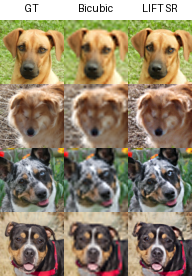
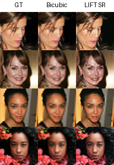

# LIFT Dual-Scale Diffusion Model

A dual-scale diffusion model that jointly denoises 64×64 and 32×32 images with independent timesteps for each scale, using dynamic programming to find optimal 2D denoising paths.

## Results

### Main Results (18 DDIM steps, 15803 images, 5 seeds)

| Epoch | Baseline | LIFT Diagonal | LIFT DP-64 | LIFT DP-Total |
|------:|---------:|--------------:|-----------:|--------------:|
| 200   | **33.07±0.13** | 87.22±0.35 | 85.75±0.39 | 80.53±0.16 |
| 400   | 41.54±0.30 | 49.60±0.28 | 51.77±0.29 | **39.35±0.26** |
| 600   | **34.04±0.16** | 50.07±0.32 | 49.77±0.22 | 46.48±0.40 |
| 800   | 40.82±0.20 | 49.07±0.44 | 48.39±0.26 | **40.43±0.31** |
| 1000  | **41.05±0.16** | 82.11±0.44 | 76.58±0.31 | 63.59±0.26 |
| 1200  | 52.32±0.29 | 72.69±0.34 | 61.05±0.26 | **40.11±0.22** |
| 1400  | 45.85±0.26 | 76.40±0.18 | 63.39±0.10 | **40.55±0.24** |
| 1600  | 48.13±0.34 | 64.89±0.31 | 60.91±0.22 | **40.28±0.39** |
| 1800  | **45.61±0.22** | 101.76±0.38 | 82.96±0.25 | 53.96±0.20 |
| 2000  | 59.37±0.19 | 69.61±0.08 | 51.83±0.15 | **36.65±0.23** |

### EMA Results (decay=0.9999, single seed)

| Epoch | Baseline EMA | LIFT EMA Diag | LIFT EMA DP-64 | LIFT EMA DP-Total |
|------:|-------------:|--------------:|---------------:|------------------:|
| 200   | **28.22** | 38.54 | 36.16 | 36.83 |
| 400   | **27.90** | 31.04 | 29.68 | 28.91 |
| 600   | **30.00** | 35.94 | 32.78 | 31.37 |
| 800   | **31.52** | 44.32 | 35.90 | 34.70 |
| 1000  | **33.05** | 46.12 | 35.05 | 34.95 |
| 1200  | **33.80** | 46.83 | 35.72 | 35.49 |
| 1400  | **34.94** | 47.32 | 35.97 | 35.92 |
| 1600  | **36.17** | 47.59 | 36.53 | 36.51 |
| 1800  | 37.11 | 49.02 | **37.69** | 37.80 |
| 2000  | 38.62 | 50.39 | 39.12 | **38.55** |

### Ablation: Single-Output Architectures (single seed)

| Epoch | single_t Diag | single_t DP | no_t Diag | no_t DP |
|------:|--------------:|------------:|----------:|--------:|
| 200   | 231.23 | 47.27 | 241.14 | 116.30 |
| 400   | 209.82 | 43.40 | 230.22 | 94.66 |
| 600   | 219.00 | **34.42** | 196.65 | **61.68** |
| 800   | 231.28 | 41.08 | 177.12 | 70.96 |
| 1000  | 220.37 | 40.90 | 170.03 | 123.01 |
| 1200  | 243.62 | 46.40 | **167.26** | 130.02 |
| 1400  | 250.40 | 40.07 | 167.25 | 92.26 |
| 1600  | 261.03 | 40.55 | 180.69 | 93.41 |
| 1800  | 256.19 | 48.80 | 187.47 | 92.91 |
| 2000  | 259.67 | 41.67 | 193.21 | 63.60 |

### Ablation: Training Noise Alignment (explore_test_5, EMA, single seed)

Tests whether aligning training noise between scales helps SingleTimestepModel:
- **same_t**: t_32 = t_64 (same timestep for both scales)
- **dp_path**: t_32 follows learned DP-64 path from LIFT EMA 400ep
- **heuristic**: t_32 = int(t_64 × 0.8)

| Epoch | same_t Diag | same_t DP | dp_path Diag | dp_path DP | heuristic Diag | heuristic DP |
|------:|------------:|----------:|-------------:|-----------:|---------------:|-------------:|
| 200   | 259.66 | 305.41 | 236.41 | 233.45 | 273.22 | 290.48 |
| 400   | 53.22 | 86.67 | 73.32 | 69.96 | 62.21 | 160.49 |
| 600   | **40.62** | **59.94** | 41.37 | 39.60 | **53.30** | 179.77 |
| 800   | 41.54 | 76.02 | **38.39** | 39.92 | 59.31 | 185.35 |
| 1000  | 47.30 | 82.05 | 39.11 | **37.06** | 61.72 | 190.60 |
| 1200  | 53.69 | 100.48 | 40.21 | 42.27 | 64.12 | 195.30 |
| 1400  | 58.20 | 107.91 | 41.87 | 37.87 | 68.48 | 206.26 |
| 1600  | 61.83 | 113.24 | 43.85 | 44.45 | 75.17 | 223.31 |
| 1800  | 65.80 | 116.96 | 46.18 | 40.08 | 83.73 | 237.07 |
| 2000  | 70.14 | 119.74 | 48.20 | 46.33 | 91.06 | 189.36 |

### Summary of Best FID

| Model | Best FID | Epoch | Notes |
|-------|----------|-------|-------|
| Baseline EMA | **27.90** | 400 | Single seed |
| LIFT EMA DP-Total | **28.91** | 400 | Single seed |
| LIFT EMA DP-64 | 29.68 | 400 | Single seed |
| LIFT EMA Diagonal | 31.04 | 400 | Single seed |
| Baseline | 33.07±0.13 | 200 | 5-seed |
| single_t DP | 34.42 | 600 | Ablation, no EMA |
| LIFT DP-Total | 36.65±0.23 | 2000 | 5-seed |
| dp_path DP (EMA) | 37.06 | 1000 | Training alignment |
| dp_path Diag (EMA) | 38.39 | 800 | Training alignment |
| same_t Diag (EMA) | 40.62 | 600 | Training alignment |
| LIFT DP-64 | 48.39±0.26 | 800 | 5-seed |
| LIFT Diagonal | 49.07±0.44 | 800 | 5-seed |
| heuristic Diag (EMA) | 53.30 | 600 | Training alignment |
| no_t DP | 61.68 | 600 | Ablation, no EMA |

## Key Findings

### 1. DP Path Optimization is Critical

DP-Total consistently outperforms Diagonal by 8-33 FID points. The effect is even more dramatic in ablation models (single_t: 219→34.42, a 185-point improvement).

| Epoch | Diagonal | DP-Total | Improvement |
|------:|---------:|---------:|------------:|
| 400   | 49.60    | 39.35    | **+10.25** |
| 800   | 49.07    | 40.43    | **+8.64** |
| 1200  | 72.69    | 40.11    | **+32.58** |
| 2000  | 69.61    | 36.65    | **+32.96** |

### 2. EMA Closes the Gap

With EMA, LIFT DP-Total (28.91) nearly matches Baseline (27.90)—a gap of only 1.01 FID points, compared to 3.6 points without EMA.

### 3. LIFT DP-Total Shows Training Stability

| Model | Best FID | Best Epoch | FID at 2000ep | Degradation |
|-------|----------|------------|---------------|-------------|
| Baseline | 33.07 | 200 | 59.37 | **+26.30** |
| LIFT DP-Total | 36.65 | 2000 | 36.65 | **+0.00** |

### 4. Timestep Information Matters (Ablation)

| Model | Diagonal | DP | DP Improvement |
|-------|----------|-----|----------------|
| single_t (has t_64) | 209.82 | **34.42** | 175 points |
| no_t (no timestep) | 167.25 | **61.68** | 106 points |

single_t DP (34.42) outperforms no_t DP (61.68), confirming that timestep conditioning helps even in single-output models.

### 5. "Low Guides High" — Coarse Scale Denoises First

A striking emergent property: **all DP-Total paths consistently denoise the 32×32 (coarse) scale faster than the 64×64 (fine) scale**. Across every epoch and both EMA and non-EMA models, 17 out of 19 path points have t_32 ahead of t_64 (i.e., 32×32 is cleaner), with 0 points where t_64 is ahead.

```
DP-Total path (EMA 400ep):
  t_64: 999 → 999 → 999 → 964 → 930 → 930 → 895 → 895 → 861 → ... → 0
  t_32: 999 → 964 → 930 → 895 → 895 → 861 → 861 → 826 → 792 → ... → 0
              ^^^    ^^^
        32 advances while    Both advance, but 32
        64 stays at 999      stays consistently ahead
```

| Epoch | Steps with t_32 cleaner | Steps with t_64 cleaner | Max deviation |
|------:|:-----------------------:|:-----------------------:|:-------------:|
| 400   | 17/19 | 0/19 | 8 grid cells |
| 800   | 17/19 | 0/19 | 4 grid cells |
| 1200  | 17/19 | 0/19 | 7 grid cells |
| 2000  | 17/19 | 0/19 | 7 grid cells |
| EMA 400  | 17/19 | 0/19 | — |
| EMA 800  | 17/19 | 0/19 | — |
| EMA 1200 | 17/19 | 0/19 | — |

**Interpretation**: The model learns an asymmetric coupling between scales — a cleaner coarse scale provides structural guidance that helps denoise the fine scale. The DP algorithm discovers this automatically by minimizing discretization error: denoising 32×32 first reduces the total error because the coarse-to-fine information flow (J_HL: ∂ε_64/∂x_32) benefits from a cleaner coarse input.

**Cross-Jacobian evidence**: The two scales are not fully decoupled. Cross-Jacobian analysis (EMA 400ep) reveals a clear "low guides high" pattern:


The raw Jacobian J_HL = ||∂ε_64/∂x_32||² (before chain-rule factor) shows:

| (t_64, t_32) | Raw J_HL | Interpretation |
|:------------:|:--------:|:--------------|
| (999, 999) — both noisy | 2.9e-7 | No cross-influence |
| (999, 0) — **noisy 64, clean 32** | **1.9e-3** | **6400× stronger** |
| (0, 999) — clean 64, noisy 32 | 2.5e-5 | Weak reverse influence |

The ratio J_HL/J_HH (cross vs self influence on 64×64) increases monotonically as t_32 decreases (32 gets cleaner):

| t_32 | 999 | 826 | 654 | 482 | 310 | 137 |
|------|-----|-----|-----|-----|-----|-----|
| J_HL/J_HH at t_64=999 | 0.04% | 0.07% | 0.11% | 0.16% | 0.20% | **0.72%** |

While cross-Jacobians are small in absolute terms, the trend is unambiguous: **the cleaner the 32×32 input, the more it influences the 64×64 prediction**. This confirms that the model learns to use coarse-scale structural information when available.

**Connection to γ_D chain-rule factor**: The alternative chain-rule factor γ_D = SNR/(4(1+SNR)²) produces an extreme version of this pattern — an L-shaped path that denoises 32×32 almost completely before starting on 64×64. However, this extreme strategy performs worse (FID 35.17 vs 28.91 with γ_B), suggesting that while "coarse first" is beneficial, pushing it too far is counterproductive. The optimal strategy is a moderate asymmetry where 32×32 leads by a few steps, not a complete sequential ordering.

### 6. Training Noise Alignment (explore_test_5)

Training SingleTimestepModel with different t_32 alignment strategies (all with EMA):

| Model | Best Diagonal FID | Best DP FID | DP helps? |
|-------|:-----------------:|:-----------:|:---------:|
| dp_path | 38.39 @ 800ep | **37.06 @ 1000ep** | Yes |
| same_t | **40.62 @ 600ep** | 59.94 @ 600ep | No (hurts) |
| heuristic | 53.30 @ 600ep | 160.49 @ 400ep | No (catastrophic) |

Key insights:
- **DP path only helps when training matches generation**: dp_path (trained with DP-aligned noise) is the only model where DP improves FID. For same_t and heuristic, DP makes things worse.
- **Heuristic t_32=0.8×t_64 is harmful**: Creates a training/generation mismatch that DP amplifies (160+ FID).
- **None beat dual-output LIFT** (28.91 DP-Total @ 400ep): Single-output architecture is fundamentally limited — predicting only noise_64 loses the benefit of jointly optimizing both scales.
- **All models overfit after 600-1000ep**: EMA delays but doesn't prevent overfitting.

### 7. Super-Resolution (32→64)

LIFT naturally supports conditional super-resolution: by setting t_32=0 (clean 32×32 input) and denoising only x_64 from pure noise, the model acts as a 32→64 SR network. No retraining is needed — the model was trained with all (t_64, t_32) pairs including t_32=0.



| Epoch | Bicubic PSNR | SR PSNR | Bicubic SSIM | SR SSIM | Bicubic LPIPS | SR LPIPS |
|------:|:------------:|:-------:|:------------:|:-------:|:-------------:|:--------:|
| 200   | 30.44 | 26.29 | 0.9477 | 0.9146 | 0.0566 | **0.0272** |
| 400   | 30.44 | 28.11 | 0.9477 | 0.9286 | 0.0566 | **0.0218** |
| 600   | 30.44 | 28.83 | 0.9477 | 0.9342 | 0.0566 | **0.0204** |
| 800   | 30.44 | 29.42 | 0.9477 | 0.9392 | 0.0566 | **0.0185** |
| 1000  | 30.44 | 29.85 | 0.9477 | 0.9433 | 0.0566 | **0.0171** |
| 2000  | 30.44 | **30.99** | 0.9477 | **0.9539** | 0.0566 | **0.0138** |

At 2000 epochs, LIFT SR **surpasses bicubic on all three metrics** — PSNR, SSIM, and LPIPS (4× better perceptually). Earlier epochs show the classic perception-distortion tradeoff (sharper details at the cost of pixel-level fidelity), but with sufficient training the model achieves both.

#### Out-of-Distribution: CelebA-HQ (human faces)

To test generalization, we evaluate the same AFHQ-trained model on CelebA-HQ (human faces it has never seen):



| Epoch | Bicubic PSNR | SR PSNR | Bicubic SSIM | SR SSIM | Bicubic LPIPS | SR LPIPS |
|------:|:------------:|:-------:|:------------:|:-------:|:-------------:|:--------:|
| 200   | 30.48 | 26.03 | 0.9491 | 0.9013 | 0.0547 | **0.0309** |
| 400   | 30.48 | 27.04 | 0.9491 | 0.9030 | 0.0547 | **0.0321** |
| 600   | 30.48 | 21.72 | 0.9491 | 0.7684 | 0.0547 | 0.1343 |
| 800   | 30.48 | 20.80 | 0.9491 | 0.7254 | 0.0547 | 0.1675 |
| 1000  | 30.48 | 21.72 | 0.9491 | 0.7494 | 0.0547 | 0.1466 |
| 2000  | 30.48 | 22.61 | 0.9491 | 0.7447 | 0.0547 | 0.1386 |

**Key observations**: At early epochs (200–400), LIFT SR generalizes well to human faces — LPIPS is better than bicubic (0.03 vs 0.05), indicating the model learns generic super-resolution priors. However, beyond 400 epochs, the model overfits to animal face structure and OOD performance degrades sharply (LPIPS jumps to 0.13+). This contrasts with in-distribution AFHQ where performance improves monotonically through 2000 epochs. The sweet spot for OOD generalization is around 200–400 epochs of training.

## Visualizations

### Optimal Path Visualization (EMA 400 epochs)

| 64×64 Error Heatmap | Total Error Heatmap |
|:-------------------:|:-------------------:|
|  |  |

### Path Convergence Across Epochs


### EMA Path Convergence Across Epochs


## Technical Details

### Discretization Error (vHv) Computation

The discretization error measures how much the model's output changes when the input is perturbed:

$$\text{Error} = v^T \left( J \odot J \right) v$$

We use the **Hutchinson trace estimator** to avoid computing the full Jacobian:

$$v^T (J \odot J) v = \mathbb{E}_{\epsilon} \left[ (J \epsilon)^2 \right]$$

### Chain-Rule Factor

The model operates in $x_t$ space (DDIM), but we want error in SNR ($\gamma$) space.

In DDIM:
$$x_t = \sqrt{\bar{\alpha}} \cdot x_0 + \sqrt{1 - \bar{\alpha}} \cdot \epsilon$$

In SNR parameterization:
$$z = \sqrt{\text{SNR}} \cdot x_0 + \epsilon$$

For the squared Jacobian (vHv):
$$(J_z)^2 = \frac{(J_{x_t})^2}{\text{SNR} \cdot (1 + \text{SNR})}$$

```python
def chain_rule_factor(snr):
    """Convert Jacobian from x_t space to z (SNR) space."""
    return 1.0 / (snr * (1.0 + snr))
```

### 2D Optimal Path Algorithm

The key insight is treating timestep scheduling as a **2D path optimization problem**. Given a 30×30 error heatmap, we find the optimal N-step path from (0,0) to (29,29) using dynamic programming.

**Cost Function**: Trapezoidal integral of error in λ-space (logSNR), with each scale weighted by its own Δλ
```python
step_cost = (e64[i,j] + e64[ni,nj])/2 * |Δλ_64| + (e32[i,j] + e32[ni,nj])/2 * |Δλ_32|
```
where `Δλ_64 = |log_snr[ni] - log_snr[i]|` is the logSNR distance for the 64×64 scale.

Using Δλ instead of grid-index distance is physically meaningful: grid indices are uniformly spaced, but logSNR spacing is non-uniform. Δλ correctly measures distance in the diffusion ODE's natural coordinate.

- **DP-64**: `e32 = 0` (only 64×64 error matters)
- **DP-Total**: both `e64` and `e32` contribute (recommended)

**Constraints**:
- Path must be monotonically increasing (can only move right/down)
- Maximum jump per step: `max_jump = 5` grid cells in each dimension
- This prevents unrealistic large jumps (e.g., t=999 → t=0 in one step)

```python
def find_optimal_path_n_steps_lambda(error_64, error_32, log_snr, num_steps=18, max_jump=5):
    """Find optimal N-step path using DP with λ-space trapezoidal cost."""
    # dp[i][j][k] = min cost to reach (i,j) in exactly k steps
    # Transition: try all (ni, nj) within max_jump distance
    # Cost: (e64[i,j]+e64[ni,nj])/2 * |Δλ_64| + (e32[i,j]+e32[ni,nj])/2 * |Δλ_32|
```

## Model Architecture

### LIFT Dual-Timestep Model (58.5M params)

```
Input Processing:
  x_64 [B, 3, 64, 64] ─────────────────┐
                                        ├─ concat ─→ [B, 6, 64, 64]
  x_32 [B, 3, 32, 32] ─→ upsample 2× ──┘

Time Embedding:
  t_64 ─→ SinusoidalEmb ─→ MLP ─┐
                                 ├─ concat ─→ MLP ─→ t_combined
  t_32 ─→ SinusoidalEmb ─→ MLP ─┘

UNet: [64, 128, 256, 512] channels
  Encoder → Bottleneck → Decoder (with skip connections)
  Attention at channels >= 128

Output Processing:
  [B, 6, 64, 64] ─→ split ─→ noise_pred_64 [B, 3, 64, 64]
                          ─→ downsample 2× ─→ noise_pred_32 [B, 3, 32, 32]
```

### Baseline Model (58.3M params)

```
Input:  x_64 [B, 3, 64, 64]
Time:   t ─→ SinusoidalEmb ─→ MLP ─→ t_emb
UNet:   [64, 128, 256, 512] channels (same as LIFT)
Output: noise_pred_64 [B, 3, 64, 64]
```

Single-scale only. No 32×32 input or output.

### Ablation: SingleTimestepModel (single_t)

```
Input Processing:
  x_64 [B, 3, 64, 64] ─────────────────┐
                                        ├─ concat ─→ [B, 6, 64, 64]
  x_32 [B, 3, 32, 32] ─→ upsample 2× ──┘

Time Embedding:
  t_64 ─→ SinusoidalEmb ─→ MLP ─→ t_emb    (t_32 unknown to model)

UNet: [64, 128, 256, 512] channels
Output: noise_pred_64 [B, 3, 64, 64] only
```

Receives x_32 as structural context but doesn't know its noise level. Only predicts 64×64 noise.

### Ablation: NoTimestepModel (no_t)

```
Input Processing:
  x_64 [B, 3, 64, 64] ─────────────────┐
                                        ├─ concat ─→ [B, 6, 64, 64]
  x_32 [B, 3, 32, 32] ─→ upsample 2× ──┘

Time Embedding: None (blind denoiser)

UNet: [64, 128, 256, 512] channels
Output: noise_pred_64 [B, 3, 64, 64] only
```

No timestep conditioning at all. Tests whether the model can denoise purely from visual structure.

## Quick Start

```bash
# Train Baseline
python train_baseline.py --epochs 2000

# Train LIFT
python train_lift.py --epochs 2000

# Evaluate all models (3 GPUs in parallel)
./scripts/eval_all.sh

# Evaluate with multiple seeds
./scripts/eval_all.sh --multi-seed

# Compute heatmap for a specific epoch
./scripts/compute_heatmap.sh 2000
```

## Dataset

AFHQ (Animal Faces HQ) 64×64, loaded via HuggingFace datasets.
