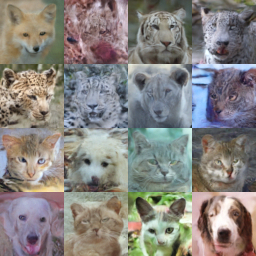
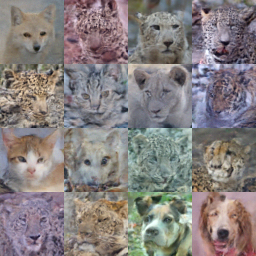
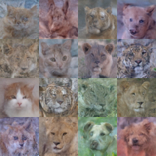

# LIFT Dual-Scale Diffusion Model

A dual-scale diffusion model that jointly denoises 64×64 and 32×32 images with independent timesteps for each scale.

## Results

### Performance Comparison (100 epochs, ~58M parameters)

| Epoch | Baseline | LIFT Diagonal | LIFT DP-64 | LIFT DP-Total | Best Model |
|-------|----------|---------------|------------|---------------|------------|
| 20    | 99.11    | 136.96        | 149.13     | **120.70**    | Baseline   |
| 40    | **56.47** | 61.11        | 78.81      | 77.66         | **Baseline** |
| 60    | 70.18    | **64.46**     | 60.24      | 64.56         | LIFT DP-64 |
| 80    | **44.77** | 62.88        | **57.46**  | 72.69         | **Baseline** |
| 100   | **40.53** | 66.53        | 71.66      | 74.44         | **Baseline** |

- **Best Baseline**: 40.53 FID (100 epochs)
- **Best LIFT**: 57.46 FID (DP-64 path, 80 epochs)


### Optimal Path Evolution


**Top row**: Optimal paths on 64×64 Error heatmaps
**Bottom row**: Optimal paths on Total Error heatmaps

- **64×64 Error optimization**: Keeps 32×32 noisy (low γ₁), focuses denoising budget on target scale
- **Total Error optimization**: Prefers cleaning both scales together (jumps to γ₁=100 early)
- **DP-64 outperforms DP-Total** from 60 epochs onward

### Generated Samples (100 Epochs)

**Baseline (FID=40.53):**


**LIFT Models:**

| Diagonal (FID=66.53) | DP-64 (FID=71.66) | DP-Total (FID=74.44) |
|----------------------|-------------------|----------------------|
|  |  |  |

## Core Findings

1. **Training space is the bottleneck**: Independent timesteps create 1M combinations (1000×1000) vs 1K for diagonal training
2. **64×64 Error optimization > Total Error**: Since FID evaluates 64×64, optimizing 64×64 error directly improves output
3. **Training-generation consistency is critical**: Model must generate with the same timestep strategy it was trained on

## Technical Details

### Discretization Error (vHv) Computation

The discretization error measures how much the model's output changes when the input is perturbed:

$$\text{Error} = v^T \left( J \odot J \right) v$$

We use the **Hutchinson trace estimator** to avoid computing the full Jacobian:

$$v^T (J \odot J) v = \mathbb{E}_{\epsilon} \left[ (J \epsilon)^2 \right]$$

### Chain-Rule Factor

The model operates in $x_t$ space (DDIM), but we want error in SNR ($\gamma$) space.

In DDIM:
$$x_t = \sqrt{\bar{\alpha}} \cdot x_0 + \sqrt{1 - \bar{\alpha}} \cdot \epsilon$$

In SNR parameterization:
$$z = \sqrt{\text{SNR}} \cdot x_0 + \epsilon$$

The relationship:
$$x_t = \frac{z}{\sqrt{\text{SNR} \cdot (1 + \text{SNR})}}$$

So the Jacobian transforms as:
$$\frac{\partial x_t}{\partial z} = \frac{1}{\sqrt{\text{SNR} \cdot (1 + \text{SNR})}}$$

For the squared Jacobian (vHv):
$$(J_z)^2 = \frac{(J_{x_t})^2}{\text{SNR} \cdot (1 + \text{SNR})}$$

```python
def chain_rule_factor(snr):
    """Convert Jacobian from x_t space to z (SNR) space."""
    return 1.0 / (snr * (1.0 + snr))
```

### DP Path to Generation Steps

1. **DP Path**: Maps γ₀ → optimal γ₁
2. **Generation Schedule**: Interpolate to N steps via `logspace(0.01, 100, num_steps)`
3. **Convert to Timesteps**: `snr_to_timestep(gamma)`

## Model Architecture

```
Input Processing:
  x_64 [B, 3, 64, 64] ─────────────────┐
                                        ├─ concat ─→ [B, 6, 64, 64]
  x_32 [B, 3, 32, 32] ─→ upsample 2× ──┘

Time Embedding:
  t_64 ─→ SinusoidalEmb ─→ MLP ─┐
                                 ├─ concat ─→ MLP ─→ t_combined
  t_32 ─→ SinusoidalEmb ─→ MLP ─┘

UNet Architecture:
  Encoder: [64, 128, 256, 512] channels
  - ResBlock + ResBlock + Attention (if channels >= 128)
  - Downsample 2×

  Bottleneck: 512 channels
  - ResBlock + Attention + ResBlock

  Decoder: [512, 256, 128, 64] channels
  - Upsample 2×
  - Skip connection (concat)
  - ResBlock + ResBlock + Attention (if channels >= 128)

Output Processing:
  [B, 6, 64, 64] ─→ split ─→ noise_pred_64 [B, 3, 64, 64]
                          ─→ downsample 2× ─→ noise_pred_32 [B, 3, 32, 32]
```

## Quick Start

```bash
# Generate with best model (Baseline 100ep)
python generate_for_fid.py \
    --checkpoint checkpoints/baseline_100ep.pth \
    --output_dir results/generated \
    --num_images 1000

# Generate with LIFT DP-64 path
python generate_for_fid.py \
    --checkpoint checkpoints/lift_dual_timestep_80ep.pth \
    --output_dir results/generated_lift \
    --mode dp_64 \
    --heatmap results/error_heatmap_80ep.pth

# Evaluate FID
python -m pytorch_fid results/fid_real results/generated
```

## Dataset

AFHQ (Animal Faces HQ) 64×64, loaded via HuggingFace datasets.
